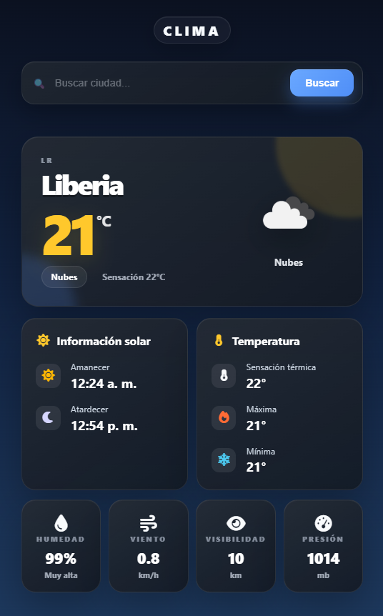
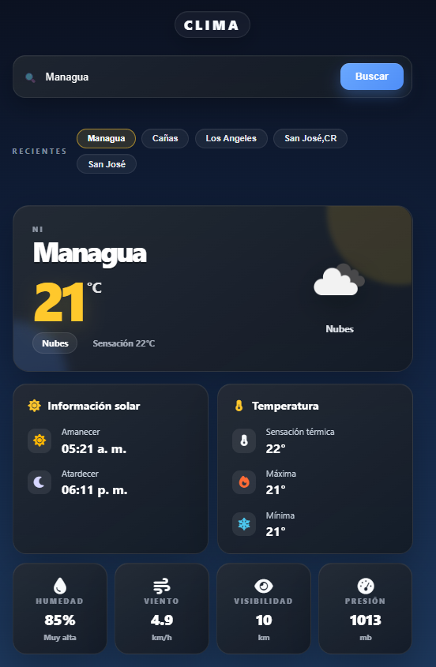
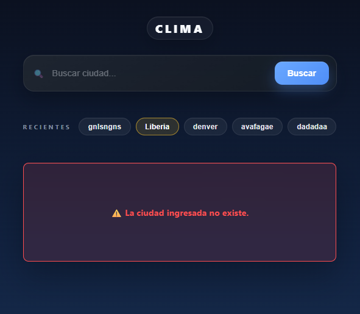
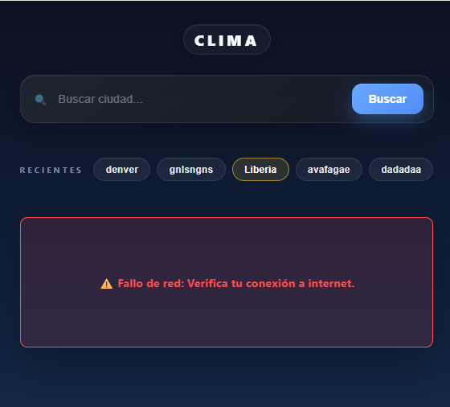

# App del Clima - G5 SolidJS

## Framework
SolidJS v1.8 con Vite · Íconos: lucide-solid

## Setup local

```bash
npm install
copy .env.example .env
# Editar .env y pegar tu API Key de OpenWeatherMap
npm run dev
```

## Configurar API Key
1. Crear cuenta en https://openweathermap.org/
2. Copiar tu API Key desde el panel
3. En el archivo `.env`: `VITE_API_KEY=tu_api_key_aqui`

## Conceptos clave de SolidJS
- `createSignal`: estado reactivo primitivo (equivalente a useState en React)
- `createResource`: fetching de datos asíncrono con estados loading/error automáticos
- `createEffect`: efectos secundarios reactivos (sincronización con localStorage)
- `Switch/Match`: estados mutuamente excluyentes (loading → error → datos)
- `Show`: renderizado condicional declarativo
- `For`: renderizado de listas reactivas
- Sin Virtual DOM: SolidJS actualiza el DOM real directamente

## Características implementadas
- [x] Buscador de ciudad (texto + Enter o botón)
- [x] Clima actual: temperatura, descripción, humedad, viento, icono
- [x] Historial de últimas 5 ciudades con acceso rápido
- [x] Spinner de carga mientras se obtienen datos
- [x] Manejo de errores (ciudad no encontrada / fallo de red)
- [x] Persistencia del historial en localStorage

## Pros/Contras de SolidJS
**Pros:** Sin Virtual DOM (muy rápido), API similar a React, reactividad granular  
**Contras:** Ecosistema más pequeño, curva de aprendizaje en reactividad fina

## Demo
URL: https://investigacion-g5-weather-solid-js.vercel.app/

## Capturas

### Vista principal — ciudad por defecto (Liberia)


### Búsqueda con historial de ciudades recientes


### Vista de Error al buscar una ciudad no existente


### Vista de Error al perder conexión
